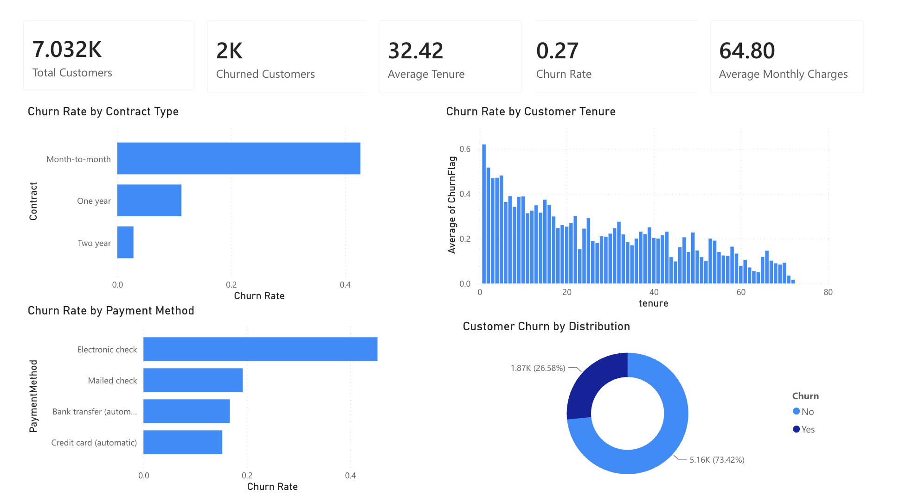
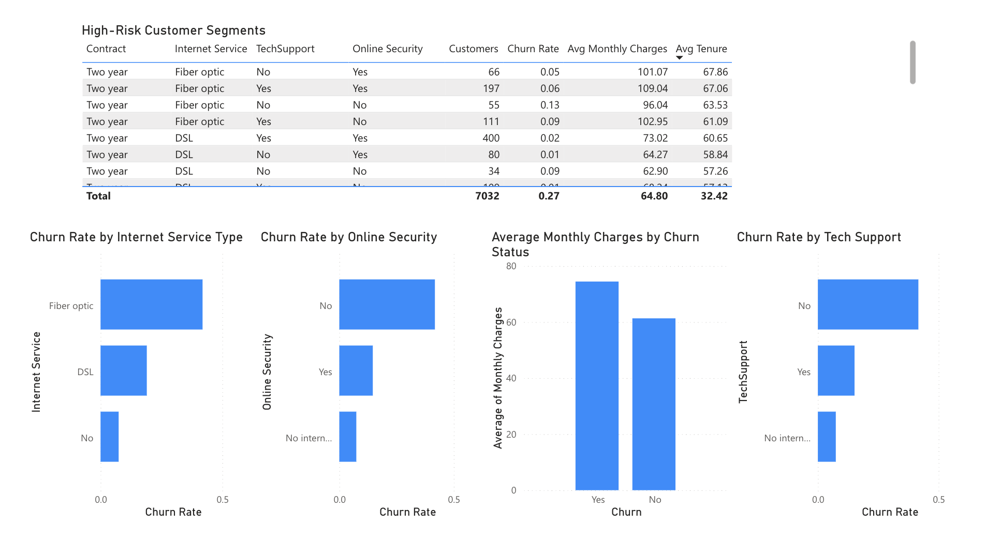
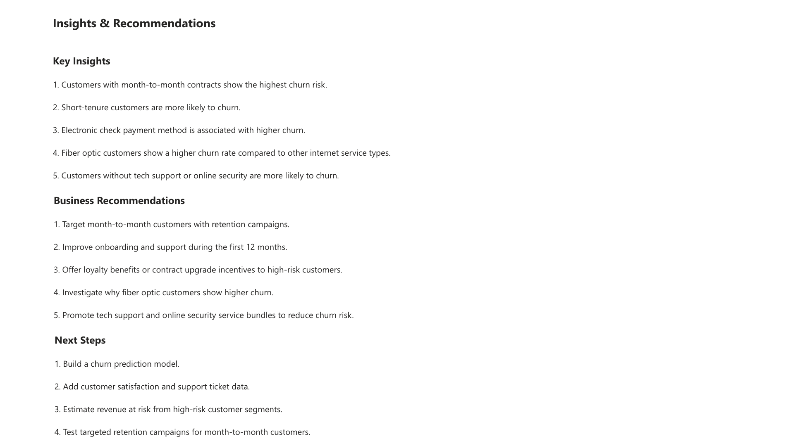

# Customer Churn Analysis

## Project Overview

This project analyzes customer churn in a telecom company using Databricks, PySpark, SQL and Power BI. The goal is to identify customer groups with higher churn risk and provide practical business recommendations for improving customer retention.

The project demonstrates an end-to-end data analytics workflow, from data cleaning and transformation to SQL-based analysis and dashboard reporting.

## Business Question

Which customer groups are most likely to churn, and what actions could the company take to reduce customer churn?

## Tools Used

- Databricks
- PySpark
- SQL
- Delta tables
- Power BI
- GitHub

## Dataset

The dataset used in this project is the Telco Customer Churn dataset. It includes customer-level information such as:

- Customer tenure
- Contract type
- Payment method
- Monthly charges
- Total charges
- Internet service type
- Additional services
- Churn status

A binary churn variable was created:

```text
ChurnFlag = 1 if the customer churned
ChurnFlag = 0 if the customer stayed
```

## Project Workflow

1. Loaded the raw customer churn dataset into Databricks
2. Reviewed the data structure and checked data quality
3. Cleaned and transformed the data using PySpark
4. Converted relevant columns into correct data types
5. Created a binary churn variable for analysis
6. Saved the cleaned dataset as a Delta table
7. Used SQL queries to analyze churn patterns
8. Exported the cleaned dataset for Power BI
9. Built a Power BI dashboard
10. Summarized key insights and business recommendations

## Key Analyses

The analysis focused on the following areas:

- Overall churn rate
- Churn by contract type
- Churn by payment method
- Churn by customer tenure
- Churn by internet service type
- Churn by tech support availability
- Churn by online security availability
- High-risk customer segments

## Key Insights

- Customers with month-to-month contracts showed the highest churn risk.
- Short-tenure customers were more likely to churn.
- Electronic check payment method was associated with higher churn.
- Fiber optic customers showed a higher churn rate compared to other internet service types.
- Customers without tech support or online security were more likely to churn.
- High-risk customer segments were especially visible when combining contract type, internet service, tech support and online security variables.

## Business Recommendations

- Target month-to-month customers with specific retention campaigns.
- Improve onboarding and customer support during the first 12 months.
- Offer loyalty benefits or contract upgrade incentives to high-risk customers.
- Investigate why fiber optic customers show higher churn.
- Promote tech support and online security service bundles to improve customer retention.
- Monitor high-value customers with high monthly charges and provide personalized retention offers.

## Dashboard Preview

### Churn Overview



### Customer Risk Segments



### Insights & Recommendations



## Repository Structure

```text
customer-churn-analysis/
├── README.md
├── notebooks/
│   └── Project1_Churn_Analysis.ipynb
├── images/
│   ├── Page1,P1.png
│   ├── Page2,P1.png
│   └── Page3,P1.png
└── data/
    └── telco_churn_cleaned_sample.csv
```

## Files

- `notebooks/` contains the Databricks notebook used for data cleaning, transformation and SQL analysis.
- `images/` contains screenshots of the Power BI dashboard.
- `data/` contains a cleaned sample dataset used for reporting and portfolio demonstration.

## Next Steps

Possible future improvements:

- Build a churn prediction model
- Add customer satisfaction data
- Add customer support ticket data
- Estimate revenue at risk from high-risk customer groups
- Test targeted retention campaigns for month-to-month customers

## Project Summary

This project shows how customer churn data can be used to identify high-risk customer segments and support data-driven customer retention decisions. The workflow combines data engineering, SQL analysis, dashboard reporting and business interpretation.
